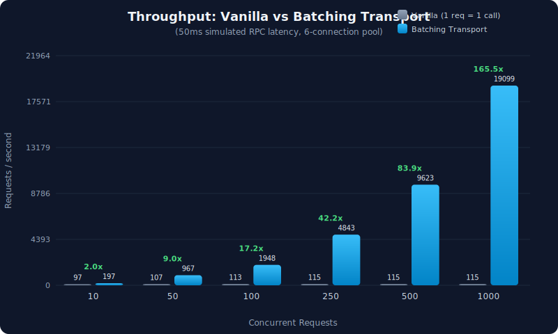
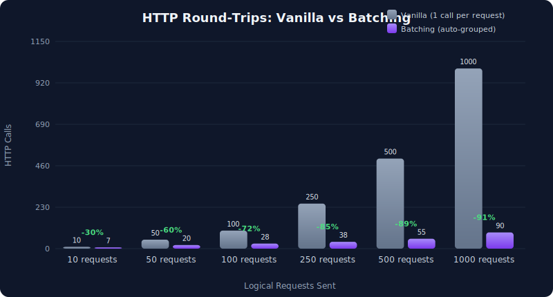

# alloy-transport-balancer

[](https://crates.io/crates/alloy-transport-balancer)
[](https://docs.rs/alloy-transport-balancer)
[](https://github.com/KaiCode2/alloy-transport-balancer#license)
[](https://github.com/KaiCode2/alloy-transport-balancer/actions/workflows/ci.yml)

Load-balanced, batching RPC transport for [alloy](https://github.com/alloy-rs/alloy) with cross-thread domain throttling and HTTP/2 multiplexing.

## Features

- **Weighted round-robin** load balancing across multiple RPC endpoints
- **Automatic failover** with exponential backoff on 429/502/503/504 errors
- **Cross-thread domain throttling** — a 429 from any thread causes all threads targeting that domain to back off
- **HTTP/2 client pooling** — one `reqwest::Client` per domain with connection reuse and multiplexing
- **Transparent request batching** — concurrent individual requests are automatically grouped into JSON-RPC batch calls
- **3-stage batch retry** — full batch → smaller batch → individual fallback for missing responses
- **Composable** — `batching` and `balancer` features can be used independently or together

## Quick Start

```rust
use alloy_transport_balancer::{LoadBalancedTransport, Weight, BalancerConfig};
use reqwest::Url;
use std::time::Duration;

// Load-balance across multiple RPC providers with weighted routing
let transport = LoadBalancedTransport::builder(vec![
    (Url::parse("https://your-primary-rpc.com").unwrap(), Weight(100)),
    (Url::parse("https://your-fallback-rpc.com").unwrap(), Weight(50)),
])
.config(BalancerConfig {
    max_retry_rounds: 3,
    heavy_throttle_threshold: Duration::from_millis(500),
    ..Default::default()
})
.build();
```

This creates a `LoadBalancedTransport` — a `tower::Service<RequestPacket>` that
can be passed directly to alloy's `RpcClient::new()` or wrapped with
[`BatchingTransport`] for automatic request grouping.

## Usage

### Weighted Endpoints

Use [`Weight`] to control traffic distribution. The default weight of 100 provides headroom for relative adjustments:

```rust
use alloy_transport_balancer::{LoadBalancedTransport, Weight};
use reqwest::Url;

let transport = LoadBalancedTransport::new(vec![
    (Url::parse("https://primary-provider.com").unwrap(), Weight(100)),   // ~63% of traffic
    (Url::parse("https://secondary-provider.com").unwrap(), Weight(50)),  // ~31% of traffic
    (Url::parse("https://fallback-provider.com").unwrap(), Weight(10)),   // ~6% of traffic
]);
```

### Builder Pattern

Use the builder for full control over retry, throttle, and HTTP client behavior:

```rust
use alloy_transport_balancer::{
    LoadBalancedTransport, Weight, BalancerConfig, ThrottleConfig, HttpClientConfig,
};
use reqwest::Url;
use std::time::Duration;

let transport = LoadBalancedTransport::builder(vec![
    (Url::parse("https://primary.example.com").unwrap(), Weight::default()),
])
.config(BalancerConfig {
    max_retry_rounds: 5,
    initial_backoff: Duration::from_millis(200),
    ..Default::default()
})
.throttle_config(ThrottleConfig {
    recovery_threshold: 3,
    ..Default::default()
})
.http_client_config(HttpClientConfig {
    pool_max_idle_per_host: 16,
    ..Default::default()
})
.build();
```

### Batching

[`BatchingTransport`] wraps any `tower::Service<RequestPacket>` — use it standalone or on top of `LoadBalancedTransport`:

```rust,no_run
use alloy_transport_balancer::{BatchingConfig, BatchingTransport, LoadBalancedTransport, Weight};
use reqwest::Url;

let inner = LoadBalancedTransport::new(vec![
    (Url::parse("https://eth.llamarpc.com").unwrap(), Weight::default()),
]);

// Requires a tokio runtime (spawns a background flush task)
let transport = BatchingTransport::new(inner, BatchingConfig {
    max_batch_size: 100,
    ..Default::default()
});
```

### Observability

Monitor throttle state across all domains:

```rust,ignore
use alloy_transport_balancer::{throttle_snapshot, log_throttle_summary, weighted_domain_backoff};

// Structured snapshots for metrics export
for snap in throttle_snapshot() {
    metrics::gauge!("rpc_throttle_level", snap.backoff_level as f64, "domain" => snap.domain);
}

// One-line tracing summary
log_throttle_summary();

// Traffic-weighted delay for adaptive concurrency control
let avg_delay = weighted_domain_backoff();
```

## When to Use Which Feature

| Scenario | Features | Why |
|----------|----------|-----|
| Multiple RPC providers per chain | `balancer` | Failover, weighted routing, domain throttling |
| Single provider, high throughput | `batching` | Reduce HTTP round-trips via batch grouping |
| Production multi-chain bot | `balancer` + `batching` (default) | Full stack: balancing, batching, throttling |
| Minimal dependency footprint | `batching` only | No `reqwest`/`alloy-transport-http` deps |

## Performance

### Benchmarks

> [!NOTE]
> **Methodology:** A mock transport simulates 50ms RPC network latency per HTTP call. The "vanilla" transport limits concurrent HTTP connections to 6 (typical for `reqwest`'s default connection pool), so requests beyond 6 must queue. `BatchingTransport` compresses all concurrent requests into a single HTTP call, eliminating the queuing bottleneck.
>
> The mock measures transport-layer overhead only — no real network I/O. All requests are `eth_call` with minimal payloads. Results are averaged over 5 iterations per data point.

<p align="center">
  
</p>

<p align="center">
  
</p>

| Concurrent Requests | Vanilla | Batching | Speedup | HTTP Calls Saved |
|:-------------------:|:-------:|:--------:|:-------:|:----------------:|
| 10 | 105ms | 52ms | **2x** | 30% |
| 100 | 885ms | 51ms | **17x** | 55% |
| 500 | 4.4s | 52ms | **84x** | 87% |
| 1,000 | 8.7s | 53ms | **166x** | 91% |

**Why the large speedup?** Vanilla with a 6-connection pool must process 1,000 requests in ceil(1000/6) = 167 sequential round-trips at 50ms each = ~8.3s. Batching packs all 1,000 into ~7 HTTP calls (150 per batch) = ~50ms total. The speedup scales linearly with concurrency because batching eliminates connection pool queuing entirely.

> Reproduce locally: `cargo run --bin chart_data --release --all-features`
> Source: [`src/bin/chart_data.rs`](src/bin/chart_data.rs)

### Design

- **Endpoint selection**: O(log n) via binary search on precomputed cumulative weight array
- **Throttle hot path**: Lock-free atomic reads (`Relaxed` ordering) — no mutex contention
- **Domain registry**: `RwLock` taken only for domain registration (startup); reads are concurrent
- **Connection reduction**: `endpoints × threads` TCP connections reduced to `domains` connections via HTTP/2 multiplexing and per-domain client pooling
- **Batch overhead**: Single requests pass through without batching overhead; batching only activates when multiple requests are pending concurrently

## Feature Flags

| Feature | Default | Dependencies Added | Description |
|---------|---------|-------------------|-------------|
| `balancer` | Yes | `alloy-transport-http`, `reqwest` | Load-balanced transport with failover and domain throttling |
| `batching` | Yes | (none) | Transparent JSON-RPC request batching |

## Configuration Reference

### `BalancerConfig`

| Field | Default | Description |
|-------|---------|-------------|
| `max_retry_rounds` | `3` | Full-rotation retry rounds after all endpoints fail |
| `initial_backoff` | `100ms` | Delay between retry rounds |
| `max_backoff` | `4s` | Maximum retry delay |
| `rate_limit_failover_delay` | `75ms` | Delay between failovers on 429 |
| `heavy_throttle_threshold` | `500ms` | Skip endpoint if domain delay exceeds this |

### `ThrottleConfig`

| Field | Default | Description |
|-------|---------|-------------|
| `max_backoff_level` | `5` | Maximum backoff level (index into table) |
| `recovery_threshold` | `5` | Consecutive successes to drop one level |
| `decay_interval_ms` | `10_000` | Auto-recovery interval: drops one backoff level per interval with no 429s (prevents permanent stalls) |
| `backoff_table` | `[0, 50, 150, 400, 1000, 2000]ms` | Delay per backoff level |

### `HttpClientConfig`

| Field | Default | Description |
|-------|---------|-------------|
| `pool_max_idle_per_host` | `8` | Idle connections per host |
| `pool_idle_timeout` | `90s` | Idle connection timeout |
| `tcp_keepalive` | `30s` | TCP keepalive interval |
| `connect_timeout` | `10s` | TCP connect timeout |
| `request_timeout` | `30s` | Overall request timeout |

> **Note:** `ThrottleConfig` and `HttpClientConfig` are process-wide defaults set via `set_default_throttle_config()` / `set_default_http_client_config()`. Once a domain is registered, it keeps its config even if the default changes. `BalancerConfig` is per-transport-instance.

### `BatchingConfig`

| Field | Default | Description |
|-------|---------|-------------|
| `max_batch_size` | `150` | Max requests per batch |
| `flush_interval` | `1ms` | Max wait before flushing |
| `max_missing_retries` | `2` | Retry rounds for missing batch responses |
| `on_batch_rejection` | `None` | Callback when RPC fully rejects a batch |

## How It Works

```text
┌─────────────────────────────────────────────────┐
│ BatchingTransport                                │
│  Accumulates Single requests into Batch          │
│  Flushes on max_batch_size or flush_interval     │
│  3-stage retry: batch → smaller batch → single   │
└──────────────────────┬──────────────────────────┘
                       │
┌──────────────────────▼──────────────────────────┐
│ LoadBalancedTransport                            │
│  Weighted round-robin endpoint selection         │
│  Retry loop with exponential backoff             │
│  Skips heavily-throttled endpoints               │
└──────────────────────┬──────────────────────────┘
                       │
┌──────────────────────▼──────────────────────────┐
│ Http<reqwest::Client>  (alloy-transport-http)    │
│  HTTP/2 multiplexing over shared TCP connections │
│  One client per domain via process-wide registry │
└─────────────────────────────────────────────────┘
```

### Cross-Thread Domain Throttling

All transport instances targeting the same domain (e.g., `alchemy.com`) share a single `DomainThrottleState` backed by atomics. When any thread receives a 429:

1. Backoff level escalates (0 → 1 → 2 → ... → 5)
2. All threads see the new level immediately via `Relaxed` atomic loads
3. Pre-request delay is applied before sending (proactive, not reactive)
4. After 5 consecutive successes, the level drops by 1 (asymmetric recovery)
5. Time-based decay automatically drops levels if no 429 for `10s × level`

This prevents thundering herd scenarios where N threads independently discover and react to the same rate limit.

## Cookbook

### Multi-Chain with Shared Throttle

```rust
use alloy_transport_balancer::{LoadBalancedTransport, BatchingTransport, BatchingConfig, Weight};
use reqwest::Url;

// Alchemy endpoints across chains share one throttle state automatically
let eth = LoadBalancedTransport::new(vec![
    (Url::parse("https://eth-mainnet.g.alchemy.com/v2/KEY").unwrap(), Weight(100)),
]);
let arb = LoadBalancedTransport::new(vec![
    (Url::parse("https://arb-mainnet.g.alchemy.com/v2/KEY").unwrap(), Weight(100)),
]);
// A 429 from eth causes arb to back off too — they share "alchemy.com" throttle
```

### Custom Metrics Export

```rust,ignore
use alloy_transport_balancer::throttle_snapshot;

fn export_metrics() {
    for snap in throttle_snapshot() {
        prometheus::gauge!("rpc_backoff_level", snap.backoff_level as f64, "domain" => &snap.domain);
        prometheus::counter!("rpc_rate_limits_total", snap.total_rate_limits as f64, "domain" => &snap.domain);
        prometheus::counter!("rpc_successes_total", snap.total_successes as f64, "domain" => &snap.domain);
    }
}
```

### Batch Rejection Callback

Wire domain throttle escalation into the batching layer:

```rust
use alloy_transport_balancer::*;
use std::sync::Arc;
use reqwest::Url;

let domain = "alchemy.com";
let throttle = domain_throttle(domain);
let on_rejection = Arc::new(move || record_batch_rejection(&throttle));

let config = BatchingConfig {
    on_batch_rejection: Some(on_rejection),
    ..Default::default()
};
```

## Error Handling

`LoadBalancedTransport` returns `alloy_transport::TransportError`. The retry behavior determines when errors surface to callers:

**Retried automatically** (callers never see these unless all endpoints fail):
- HTTP 429 (Too Many Requests) — triggers domain throttle escalation
- HTTP 502, 503, 504 (gateway errors)
- Connection failures and timeouts
- Backend gone

**Returned immediately** (not retried):
- HTTP 400, 401, 403, 404 (client errors)
- JSON-RPC errors (`{"error": {"code": -32600, ...}}`)
- Malformed responses

**When the transport gives up:**
After `max_retry_rounds` (default: 3) full rotations through all endpoints with exponential backoff, the last error is returned. Total worst-case attempts = `endpoints × (1 + max_retry_rounds)`.

**`BatchingTransport` errors:**
Individual requests within a batch receive errors independently. If an RPC omits responses for some requests, the 3-stage retry handles it. If all retries are exhausted, remaining requests receive a `"missing response in batch"` error via their oneshot channels.

## Compatibility

### HTTP Client

`LoadBalancedTransport` uses `reqwest` (via `alloy-transport-http`) for HTTP/2 multiplexing and connection pooling. **Hyper is not currently supported** for the load balancer — the client pool is tightly integrated with `reqwest::ClientBuilder`.

`BatchingTransport` is generic over any `tower::Service<RequestPacket>` and works with any HTTP backend, including hyper.

### alloy Version

This crate depends on `alloy-transport-http` 1.8+, which uses **reqwest 0.13**. Some alloy crates (notably `alloy-rpc-client`) may still depend on reqwest 0.12. If you encounter "mismatched types" errors when passing the transport to `RpcClient::new()`, this version mismatch is the cause. It will resolve as the alloy ecosystem completes the migration to reqwest 0.13.

In the meantime, `LoadBalancedTransport` and `BatchingTransport` correctly implement `tower::Service<RequestPacket>` and are fully compatible with any alloy consumer that uses the same reqwest version.

## Comparison to Alternatives

| Approach | Failover | Throttle Sharing | Batching | HTTP/2 Pooling |
|----------|----------|-----------------|----------|----------------|
| Single `Http<Client>` | No | N/A | No | Per-instance |
| Manual round-robin | Yes (custom) | No | No | Per-instance |
| `tower::balance::p2c` | Yes | No | No | Per-instance |
| **`alloy-transport-balancer`** | **Yes** | **Cross-thread** | **Yes** | **Per-domain** |

## License

Licensed under the [MIT license](https://github.com/KaiCode2/alloy-transport-balancer/blob/main/LICENSE).
